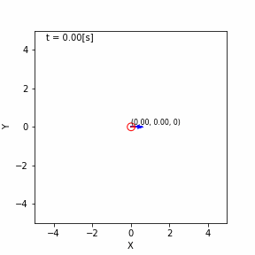
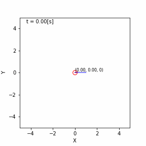

# gnss_fusion_learning

---
* This package is licensed under MIT license.
* The code lines in this package are partially derived from [ryuichiueda/LNPR](https://github.com/ryuichiueda/LNPR) (© Ryuichi Ueda 2019) under MIT license.
---

## Overview
This provides python scripts and jupyter notebook for localization.

## MCL (Monte Carlo Localization)

## EKF (Extended Kalman Filter)

## UKF (Unscented Kalman Filter)

## Computation time (MCL vs EKF vs UKF)
The computation time required for each method is shown in the table below. The number of trials is 100, and the numbers in parentheses in the MCL indicate the number of particles. It is good to see that the processing speed rankings are the same as the theoretical ones.

| Time (sec)    | MCL (100) | MCL (1000) |  EKF  |  UKF  | 
| ------------- | :-------: | :--------: | :---: | :---: | 
| Average Time  |   4.414   |   35.223   | 0.631 | 0.730 | 
| Maximum Time  |   6.485   |   43.219   | 0.805 | 0.992 | 
| Minimum Time  |   3.984   |   34.136   | 0.588 | 0.675 | 

## Reference
[1] [https://github.com/ryuichiueda/LNPR_SLIDES](https://github.com/ryuichiueda/LNPR_SLIDES)   
[2] [https://github.com/NaokiAkai/AutoNaviSim](https://github.com/NaokiAkai/AutoNaviSim)   
[3] [https://github.com/motokimura/kalman_filter_witi_kitti](https://github.com/motokimura/kalman_filter_witi_kitti)   
[4] [https://myenigma.hatenablog.com/entry/20140825/1408975706](https://myenigma.hatenablog.com/entry/20140825/1408975706)  
[5] [https://tech.tier4.jp/entry/2021/08/04/160000](https://tech.tier4.jp/entry/2021/08/04/160000)  
[6] [https://codingcorner.org/unscented-kalman-filter-ukf-best-explanation-with-python/](https://codingcorner.org/unscented-kalman-filter-ukf-best-explanation-with-python/)