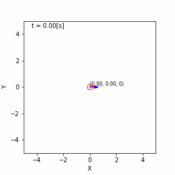

# gnss_fusion_learning

---
* This package is licensed under MIT license.
* The code lines in this package are partially derived from [ryuichiueda/LNPR](https://github.com/ryuichiueda/LNPR) (© Ryuichi Ueda 2019) under MIT license.
---

## Overview
This provides python scripts and jupyter notebook for localization.

## MCL (Monte Carlo Localization)

## GPF (Gaussian Particle Filter)

## EKF (Extended Kalman Filter)

## UKF (Unscented Kalman Filter)

## EnKF (Ensemble Kalman Filter)

## Computation time
The computation time required for each method is shown in the table below. The number of trials is 100.

| Time (sec)    | MCL (100) |  GPF (100) |  EKF  |  UKF  |  EnKF (20) | 
| ------------- | :-------: | :--------: | :---: | :---: | :--------: | 
| Average Time  |   4.414   |   4.617    | 0.631 | 0.730 |    0.706   | 
| Maximum Time  |   6.485   |   6.421    | 0.805 | 0.992 |    1.168   | 
| Minimum Time  |   3.984   |   4.337    | 0.588 | 0.675 |    0.646   | 

## Reference
[1] [https://github.com/ryuichiueda/LNPR_SLIDES](https://github.com/ryuichiueda/LNPR_SLIDES)   
[2] [https://github.com/NaokiAkai/AutoNaviSim](https://github.com/NaokiAkai/AutoNaviSim)   
[3] [https://github.com/motokimura/kalman_filter_witi_kitti](https://github.com/motokimura/kalman_filter_witi_kitti)   
[4] [https://myenigma.hatenablog.com/entry/20140825/1408975706](https://myenigma.hatenablog.com/entry/20140825/1408975706)  
[5] [https://tech.tier4.jp/entry/2021/08/04/160000](https://tech.tier4.jp/entry/2021/08/04/160000)  
[6] [https://codingcorner.org/unscented-kalman-filter-ukf-best-explanation-with-python/](https://codingcorner.org/unscented-kalman-filter-ukf-best-explanation-with-python/)